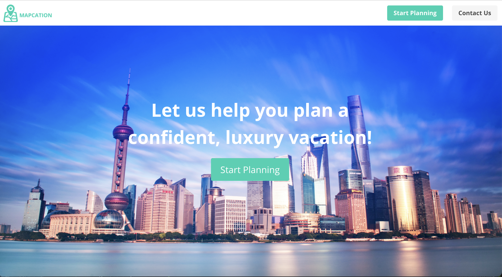
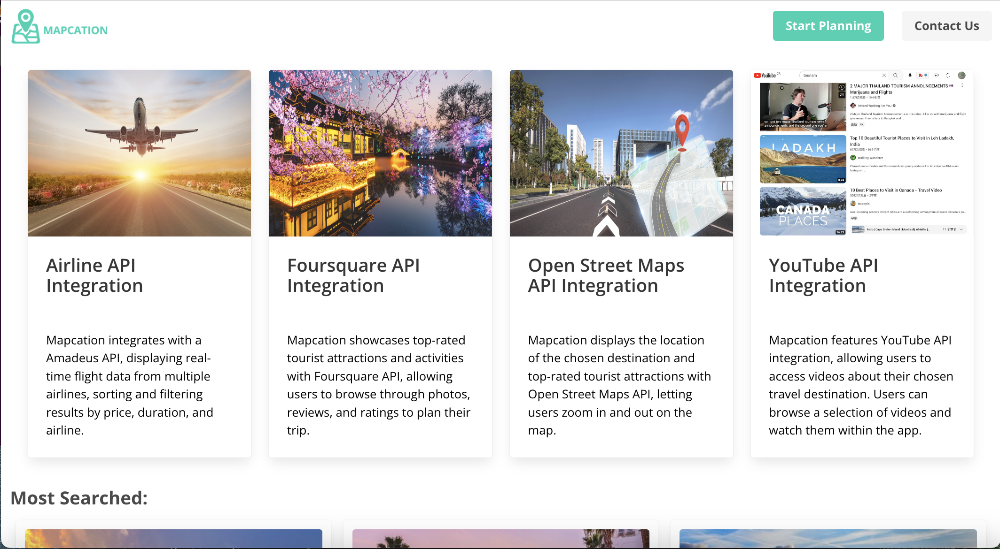
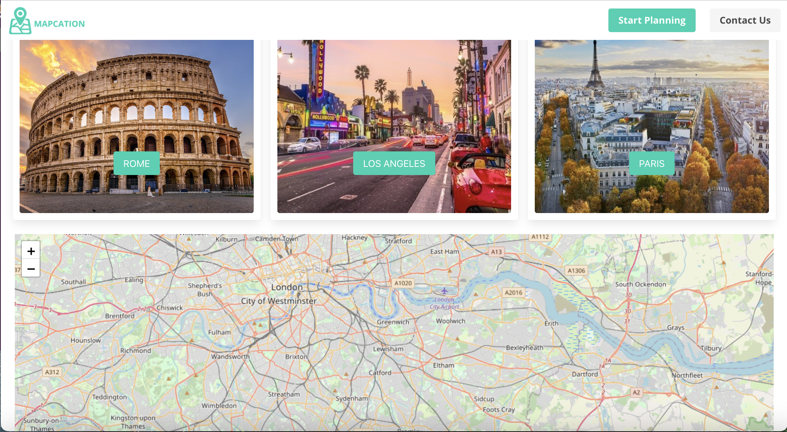
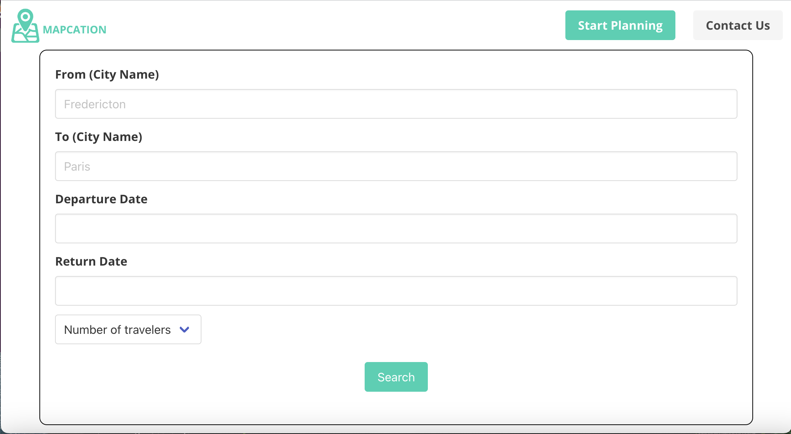
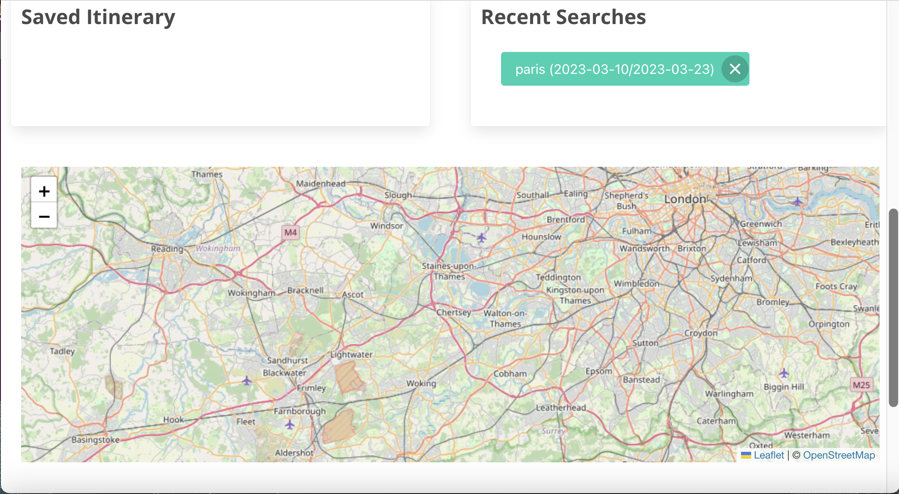
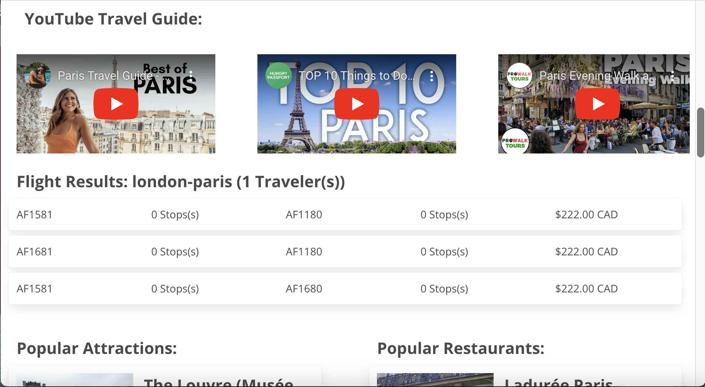

# group-project-1

## Mapcation

## Contents

1: Project Description 
2: Deployed Page link
3: Mock-up
4: user story
5: acceptance criteria
6: Contributions

## Project Description 
Mapcation is a group project using four serverside APIs. We are using Amadeus, Foursquare, OpenStreet map and YouTube APIs to get out web application working.
You can get real time flights and fare for the flights.You will get suggestions about popular places and restaurants at your destination. you can add the resturant and places to the map and drop pins there. You can choose to watch from multiple youtube videos appeared on page about destination.

## Future Work

There are many features that can be added in future. We can integrate weather Apis and get the historical weather for the destination at the time of travel.

WE can potentially add currency convertor to our application for the user convenience. 

We can add many more features for the map. The map should display relevant information such as landmarks, tourist attractions, distance between two attractions and transportation options.

## deployed page link

https://aturner1995.github.io/Mapcation/index.html

## Mock-Up

The following image shows the web application's appearance and functionality:

## User Story

As a user, I want to be able to view a map of my destination city so that I can better understand its layout and plan my trip accordingly.

As a user, I want the map from openstreetmap to show a pin of my saved searches so I can see the distance between them.

As a user, I want to be able to view videos related to my destination city so that I can get a better sense of its culture and attractions.

As a user, I want to be able to discover popular places to eat and visit in my travel destination city so that I can plan my itinerary better.

As a user, I want to be able to search for flights to my desired destination so that I can plan my trip efficiently.

As a user, I want to see the top searched cities on the website so that I can easily find popular destinations.

As a user, I want to see a hero section on the website so that I can understand the purpose of the website.

## Acceptance Criteria

The user should be able to enter their destination city and view a map of that city.
The map should be zoomable and draggable so that the user can explore different areas of the city.

Saving an attraction to the fav locations will automatically add a pin to the map

The YouTube API should integrate with the project to search for videos related to the user's destination city.
The user should be able to view a list of video suggestions, along with their titles and thumbnails.
The user should be able to click on a video to watch it.
The video player should be embedded within the project and allow the user to control playback and adjust the volume.

The Foursquare feature should integrate to display relevant information for the user's destination city.
The user should be able to view the top-rated restaurants and tourist attractions in the destination city.
The suggestions should include photos, reviews, and other relevant information for each result.

The Amadeus should integrate with the Amadeus for Developers API to search for flights.
The user should be able to enter their origin and destination cities, along with the dates of their trip.
The Amadeus should display a list of available flights, along with their prices and other relevant details.

Top Searches section should show the three most popular cities visited on the website.
Top Searches section should be clickable and take the user to the search page.
Top Searches section should pass search parameters to the search page when clicked.

A hero section should be added to the website.
The hero section should be styled using the Bulma CSS framework and CSS.
The hero section should match the wireframe provided.

## contribution
Aaron, Matt, Sehar, Arash 

- - -
All Rights Reserved.